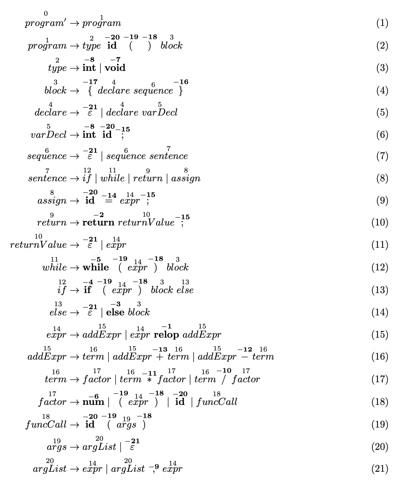
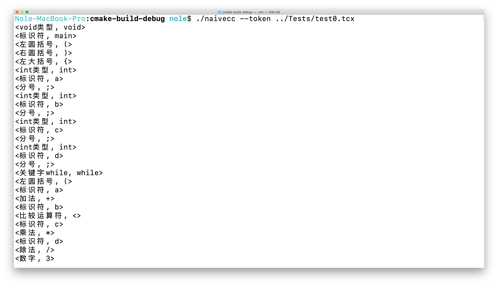
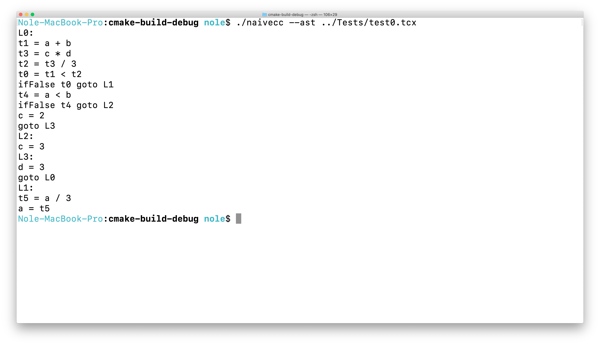
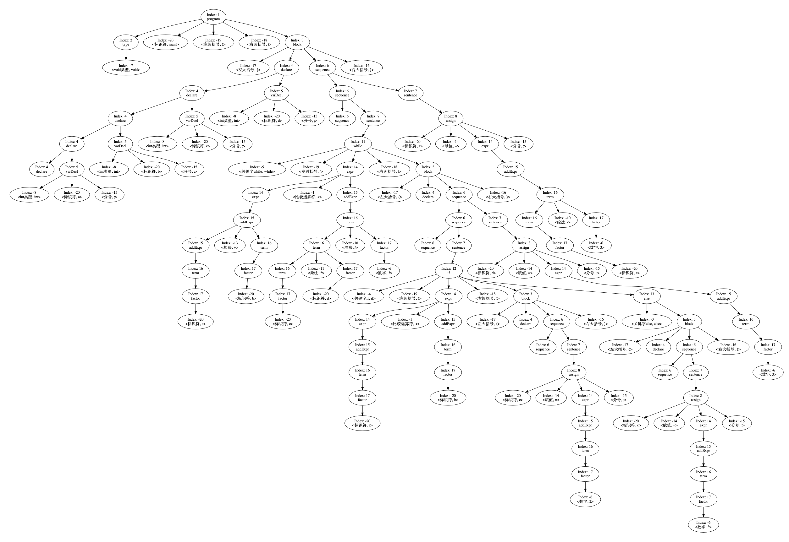
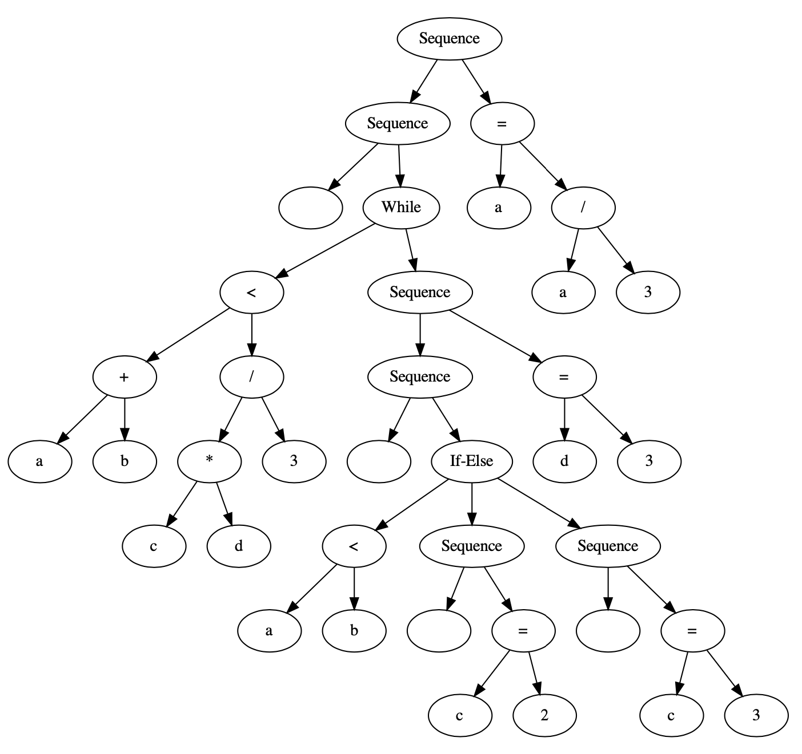
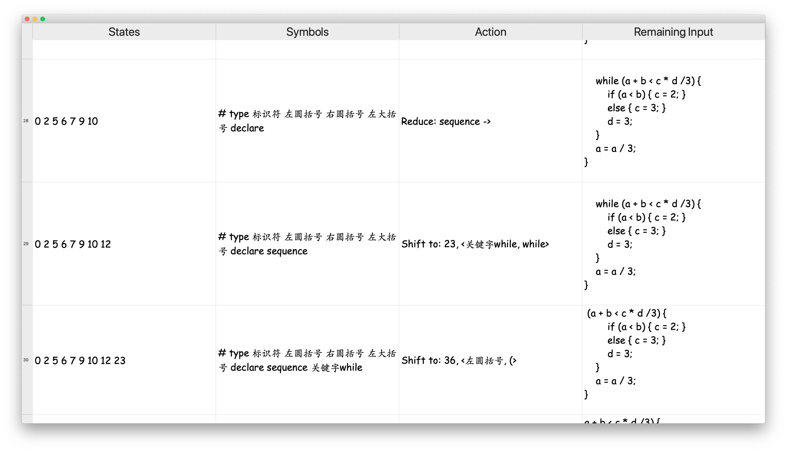

# NaiveCC: a compiler frontend for a subset of C

This is a toy compiler frontend for a subset of the C programming language based on the LR(1) parsing technique that supports:
- Token stream output
- Intermediate code generation
- Parse tree & AST visualization
- LR(1) parsing step visualization

## Prerequisites

- QT 5
- C++ 17
- Graphviz

## Grammar Definition

## Features

### Lexing

### Intermediate code generation

### Parse tree visualization

### AST visualization

### Parsing step table

